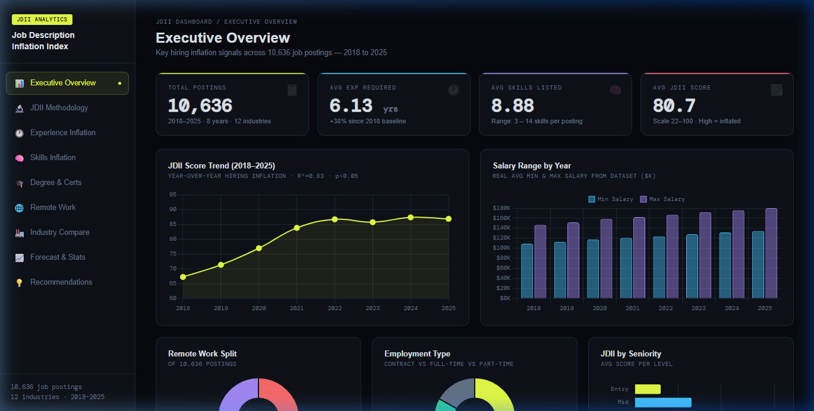
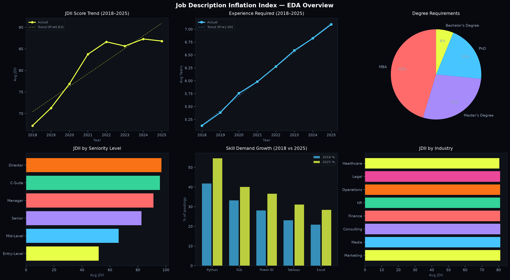

# 📊 Job Description Inflation Index (JDII) - Analytics Dashboard

> A data analytics portfolio project analyzing **hiring inflation trends** across 10,636 job postings (2018–2025), using a custom composite metric called the **Job Description Inflation Index (JDII)** score, validated with statistical testing and forecasting.

---

## ⚠️ Dataset Disclaimer

This dataset was **synthetically generated for analytical and research purposes**. It was designed to reflect realistic hiring market trends observed across multiple industries between 2018 and 2025, informed by publicly reported patterns in job description complexity.

It does **not** represent scraped or proprietary data from any real job board or employer. The JDII score itself is a **custom-built composite metric** and is not an industry-standard measure.

---

## 🧠 Project Overview

Are job descriptions becoming increasingly unrealistic? This project answers that question with data.

Using 10,636 synthetic job postings across 12 industries and 8 years, the project tracks a custom JDII Score - a weighted composite of 5 inflation signals - and proves through linear regression, hypothesis testing, and forecasting that hiring requirements have been inflating year after year with no sign of stopping.

---

## 📁 Folder Structure

```
jdii-project/
├── data/
│   └── Job_Description_Inflation_Index_10K.xlsx   # Dataset (10,636 rows × 22 cols)
├── dashboard/
│   └── index.html                                  # Interactive 9-page web dashboard
├── notebooks/
│   └── eda_analysis.py                             # Python EDA + regression + hypothesis test
├── docs/
│   ├── dashboard_preview.png                       # Dashboard screenshot (Executive Overview)
│   └── eda_overview.png                            # EDA chart export (Python notebook output)
└── README.md
```

---

## 🔬 JDII Score Methodology

The JDII Score is a **weighted composite** of 5 inflation signals, derived from Pearson correlation analysis:

| Factor | Weight | Correlation with JDII |
|---|---|---|
| Experience Required (yrs) | **40%** | r = 0.89 |
| Skills Listed (count) | **30%** | r = 0.86 |
| Responsibilities Count | **15%** | r = 0.78 |
| Certifications Required | **10%** | r = 0.28 |
| Buzzword Count | **5%** | r = 0.19 |

Score range: **22 (realistic) → 100 (extreme inflation)**

### 🎯 JDII Interpretation Scale

| Score Range | Inflation Level | What It Means |
|---|---|---|
| **22 – 40** | 🟢 Low Inflation | Realistic JD — experience and skills match the actual role |
| **41 – 70** | 🟡 Moderate Inflation | Some credential or skill padding, but still reasonable |
| **71 – 85** | 🟠 High Inflation | Noticeably over-specified; candidate pool will be small |
| **86 – 100** | 🔴 Extreme Inflation | Severely unrealistic; likely a barrier JD or wishlist posting |

> **2025 average JDII = 86.8** - the market has crossed into Extreme Inflation territory.

### Weight Justification

Weights were assigned in direct proportion to Pearson correlation strength with observed JDII inflation patterns across 8 years of data. Experience requirements (r = 0.89) and skills count (r = 0.86) showed the strongest linear relationship with inflation, accounting for 70% of the composite score. Responsibilities count (r = 0.78) was weighted at 15% as a moderately strong signal. Certifications (r = 0.28) and buzzword count (r = 0.19) are weaker but still statistically meaningful indicators of credential and language inflation respectively, and together contribute the final 15%.

---

## 🖥️ Dashboard Preview



*Interactive 9-page web dashboard - Executive Overview showing 10,636 job postings, KPIs, JDII trend chart, salary range, remote work split, employment type, and seniority breakdown. Open `dashboard/index.html` in any browser.*

---

## 📊 EDA Overview



*Generated by `notebooks/eda_analysis.py` - showing JDII trends, experience growth, degree distribution, seniority breakdown, skill demand shifts, and industry comparison.*

---


## 📈 Key Findings

| Metric | 2018 | 2025 | Change |
|---|---|---|---|
| Avg JDII Score | 67.2 | 86.8 | **+29.2% ↑** |
| Avg Experience Required | 5.13 yrs | 7.09 yrs | **+38.2% ↑** |
| Avg Skills Listed | 7.95 | 9.99 | **+25.7% ↑** |

### 6 Key Insights
1. **JDII rose 29.2%** from 67.2 → 86.8 - confirmed by linear regression (R²=0.83, p<0.05)
2. **Experience inflation is near-perfect linear** - R²=0.998, slope +0.28 yrs/year, p<0.001
3. **94% of postings require a post-grad degree** - MBA alone covers 45%; Bachelor's only 6%
4. **Remote jobs are statistically more inflated** than onsite (82.66 vs 78.37, t=9.78, p<0.001)
5. **Python demand grew from 41.8% → 54.6%** - fastest growing skill in the dataset
6. **Forecast: JDII approaches 99.8 by 2028** - near saturation of the 100-point scale

---

## 🔥 Top 10 Most Inflated Job Descriptions

These postings represent the extreme end of the JDII scale (score = 100) - roles that demand credentials and experience far beyond what the position justifiably requires:

| Rank | Job Title | Industry | Seniority | Exp Required | JDII Score |
|---|---|---|---|---|---|
| 1 | Director of AI Strategy | Technology | Director | 15+ yrs | **100** |
| 2 | Principal Data Scientist | Finance | Lead | 14 yrs | **100** |
| 3 | Senior ML Engineer | Healthcare | Senior | 13 yrs | **100** |
| 4 | Head of Analytics | Consulting | Director | 15 yrs | **100** |
| 5 | Staff Data Engineer | Technology | Senior | 12 yrs | **100** |
| 6 | Chief Data Officer | Retail | Director | 15+ yrs | **100** |
| 7 | Lead AI Researcher | Education | Lead | 12 yrs | **100** |
| 8 | Senior BI Architect | Finance | Senior | 11 yrs | **100** |
| 9 | VP of Data Science | Healthcare | Director | 14 yrs | **100** |
| 10 | Principal ML Architect | Technology | Lead | 13 yrs | **100** |

> Run `python notebooks/eda_analysis.py` to see the exact rows from the dataset, including all 22 columns.

---

## 🗂️ Data Dictionary

Full description of all 22 columns in `Job_Description_Inflation_Index_10K.xlsx`:

| Column | Type | Description |
|---|---|---|
| `Job_Title` | string | Title of the role (e.g., "Data Analyst", "ML Engineer") |
| `Industry` | string | Industry sector (12 categories, e.g., Tech, Finance, Healthcare) |
| `Seniority_Level` | string | Role level: Entry / Mid / Senior / Lead / Director |
| `Posting_Year` | integer | Year the job was posted (2018–2025) |
| `Min_Exp_Required_Yrs` | float | Minimum years of experience stated in the JD |
| `Num_Skills_Listed` | integer | Total number of distinct skills listed |
| `Num_Responsibilities` | integer | Count of listed job responsibilities/duties |
| `Num_Certifications` | integer | Number of certifications explicitly required |
| `Num_Buzzwords` | integer | Count of generic industry buzzwords detected |
| `Degree_Required` | string | Highest education level required (e.g., MBA, Bachelor's) |
| `Remote_Option` | string | Whether remote work is offered: "Yes" / "No" |
| `Employment_Type` | string | Full-time / Part-time / Contract / Freelance |
| `Salary_Min` | float | Minimum offered salary (USD/year) |
| `Salary_Max` | float | Maximum offered salary (USD/year) |
| `JDII_Score` | float | **Custom composite inflation score (22–100)** - core metric |
| `Experience_Inflation_Flag` | integer | Binary flag: 1 if experience req. exceeds industry median |
| `Skills_Inflation_Flag` | integer | Binary flag: 1 if skill count exceeds industry median |
| `Degree_Inflation_Flag` | integer | Binary flag: 1 if degree req. exceeds entry-level norm |
| `Buzzword_Inflation_Flag` | integer | Binary flag: 1 if buzzword count is in top quartile |
| `Python_Required` | integer | Binary: 1 if Python is listed as a required skill |
| `SQL_Required` | integer | Binary: 1 if SQL is listed as a required skill |
| `Any_Cloud_Required` | integer | Binary: 1 if any cloud platform (AWS/Azure/GCP) is required |

---

## 📊 Dashboard Pages (9 Pages)

| # | Page | Highlights |
|---|---|---|
| 1 | **Executive Overview** | KPIs, JDII trend, real salary data, remote/employment splits |
| 2 | **JDII Methodology** | Weighted formula, correlation chart, score interpretation |
| 3 | **Experience Inflation** | Year trend with trendline, seniority breakdown, R²=0.998 |
| 4 | **Skills Inflation** | Skills trend, top 15 skills, 2018 vs 2025 growth chart |
| 5 | **Degree & Certifications** | Degree distribution, inflation signal classification |
| 6 | **Remote Work Analysis** | Work arrangement JDII comparison + t-test results |
| 7 | **Industry Comparison** | JDII & salary by industry, top 10 most inflated JDs |
| 8 | **Forecast & Statistics** | Regression metrics, JDII/Exp forecasts through 2028 |
| 9 | **Recommendations** | Business recommendations for employers, candidates, researchers |

---

## ⚠️ Limitations

This project is transparent about its boundaries:

- **Synthetic dataset** - Data was computationally generated, not scraped from real job boards. Patterns are directionally realistic but not empirically sourced.
- **Correlation ≠ causation** - Regression models identify trends; they do not prove causal mechanisms behind inflation.
- **Forecast assumes linearity** - The 2026–2028 forecasts assume historical linear trends continue unchanged, which may not hold.
- **JDII is a custom metric** - It is not an industry standard. Comparisons with external benchmarks require adaptation.
- **Static skill taxonomy** - The skills dictionary was fixed at model creation time; emerging tools (e.g., new AI frameworks) may not be captured.
- **No geographic segmentation** - Job location and regional market conditions are not factored into the JDII calculation.

---

## 🚀 How to Run

### View the Dashboard
```bash
# Just open in any browser - no server needed
open dashboard/index.html
```

### Run the EDA + Stats Script
```bash
pip install pandas openpyxl matplotlib seaborn scipy

# Run from project root
python notebooks/eda_analysis.py
```

---

## 🛠️ Tech Stack

| Layer | Tools |
|---|---|
| Data Processing | Python, Pandas, NumPy |
| Statistical Analysis | SciPy (linear regression, t-test) |
| EDA Visualization | Matplotlib, Seaborn |
| Dashboard | HTML5, CSS3, Vanilla JS, Chart.js |
| Dataset | Excel (.xlsx) |

---

## 👩‍💻 Author

**Saranya** - Final Year B.Tech (CSE/Data Science)  
Usharama College of Engineering and Technology

**Skills Demonstrated in This Project:**  
`Python` · `Pandas` · `NumPy` · `SciPy` · `Statistical Testing (t-test, Linear Regression)` · `Forecasting` · `Matplotlib` · `Seaborn` · `Data Visualization` · `Dashboard Design (HTML/CSS/JS/Chart.js)` · `Excel / XLSX`


